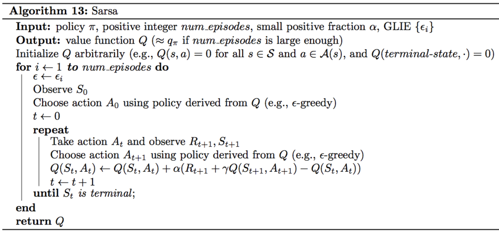

# Temporal-Difference Methods

## TD Control
Whereas Monte Carlo (MC) prediction methods must wait until the end of an episode to update the value function estimate, temporal-difference (TD) methods update the value function after every time step.

- **Sarsa(0)** (or **Sarsa**) is an on-policy TD control method. It is guaranteed to converge to the optimal action-value function q∗, as long as the step-size parameter α is sufficiently small and ϵ is chosen to satisfy the **Greedy in the Limit with Infinite Exploration (GLIE)** conditions.
- **Sarsamax** (or **Q-Learning**) is an off-policy TD control method. It is guaranteed to converge to the optimal action value function q∗, under the same conditions that guarantee convergence of the Sarsa control algorithm.
- **Expected Sarsa** is an on-policy TD control method. It is guaranteed to converge to the optimal action value function q∗, under the same conditions that guarantee convergence of Sarsa and Sarsamax.

### TD Control: Sarsa

Monte Carlo (MC) control methods require us to complete an entire episode of interaction before updating the Q-table. Temporal Difference (TD) methods will instead update the Q-table after every time step.

### TD Control: Q-Learning

### TD Control: Expected Sarsa

## TD Control: Theory and Practice

### Greedy in the Limit with Infinite Exploration (GLIE)

------

The **Greedy in the Limit with Infinite Exploration (GLIE)** conditions were introduced in the previous lesson, when we learned about MC control. There are many ways to satisfy the GLIE conditions, all of which involve gradually decaying the value of ϵ∗ when constructing ϵ∗-greedy policies.

In particular, let ϵi correspond to the i-th time step. Then, to satisfy the GLIE conditions, we need only set ϵi such that:

- ϵi>0 for all time steps i, and 
- ϵi decays to zero in the limit as the time step i approaches infinity (that is, limi→∞ϵi=0),

### In Theory

------

All of the TD control algorithms we have examined (Sarsa, Sarsamax, Expected Sarsa) are **guaranteed to converge** to the optimal action-value function q∗, as long as the step-size parameter α is sufficiently small, and the GLIE conditions are met. 

Once we have a good estimate for q∗, a corresponding optimal policy π∗ can then be quickly obtained by setting π∗(s)=argmaxa∈A(s)q∗(s,a) for all s∈S..

### In Practice

------

In practice, it is common to completely ignore the GLIE conditions and still recover an optimal policy.

### Optimism

------

You have learned that for any TD control method, you must begin by initializing the values in the Q-table. It has been shown that [initializing the estimates to large values](http://papers.nips.cc/paper/1944-convergence-of-optimistic-and-incremental-q-learning.pdf) can improve performance. For instance, if all of the possible rewards that can be received by the agent are negative, then initializing every estimate in the Q-table to zeros is a good technique. In this case, we refer to the initialized Q-table as **optimistic**, since the action-value estimates are guaranteed to be larger than the true action values.

## Analyzing Performance
------
You've learned about three different TD control methods in this lesson. *So, what do they have in common, and how are they different?*

- On-policy TD control methods (like Expected Sarsa and Sarsa) have better online performance than off-policy TD control methods (like Q-learning), but learns the optimal policy, and. 
- Expected Sarsa generally achieves better performance than Sarsa, , but learns a sub-optimal "safe" policy.

### Similarities
------

All of the TD control methods we have examined (Sarsa, Sarsamax, Expected Sarsa) converge to the optimal action-value function q∗ (and so yield the optimal policy π∗) if:

1. the value of ϵ decays in accordance with the GLIE conditions, and
2. the step-size parameter α∗ is sufficiently small.

### Differences

------

The differences between these algorithms are summarized below:

- Sarsa and Expected Sarsa are both **on-policy** TD control algorithms. In this case, the same (ϵ-greedy) policy that is evaluated and improved is also used to select actions.
- Sarsamax is an **off-policy** method, where the (greedy) policy that is evaluated and improved is different from the (ϵ-greedy) policy that is used to select actions.
- On-policy TD control methods (like Expected Sarsa and Sarsa) have better online performance than off-policy TD control methods (like Sarsamax). 
- Expected Sarsa generally achieves better performance than Sarsa.

### Instructions

--------

This project is a part of [Udacity Deep Reinforcement Learning Nanodegree](https://www.udacity.com/course/deep-reinforcement-learning-nanodegree--nd893). Follow the instructions in `Temporal_Difference.ipynb` to write your own implementations of many temporal-difference methods!
